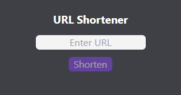
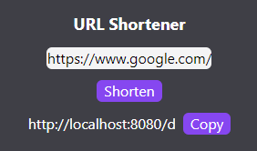

## Implementation Details

<!-- Provide a short description of your implementation (technologies used, brief overview of project architecture, etc.) -->

### Technologies

I wanted to use this as an opportunity to learn Next.js, which I have not used before. I spent some time outside of this project to get a basic understanding of Next.js. If I used what I am most familiar with, I would have used Angular.

- Next.js
- React
- Tailwind
- Typescript

### Architecture

- Home page `http://localhost:8080/` - `src/app/page.tsx`
- Shorten URL API `POST http://localhost:8080/api/shorturl` - `src/app/api/shorturl/route.ts`
  - Request body: `{"url": "google.com"}`
  - Response body: `{"shortUrl": "http://localhost:8080/abc"}`
- Shortened URL `http://localhost:8080/abc` redirects to provided URL if valid - `src/app/[shortUrl]/page.tsx`

- To shorten the URL's, I generated the link using an encoded integer key associated with the submitted URL. - `src/app/lib/shortenedurlstore.ts`

## How to Run

<!--
- Include instructions on how to run your implementation locally. Be sure to include any necessary setup steps, such as installing dependencies, as well as the commands to start the application.
-->

```
# Install dependencies
npm install

# Build
npm run build

# Start
npm run start
```

## Testing

<!-- Describe how you tested your solution (automated testing, manual testing process, screenshots, etc.) -->

I manually tested the project. I didn't have time to write any automated tests, but if I did I would have focused on adding unit tests around the shortened url store and the API endpoints.

### Zero State



### Shortened Link Generated



### Invalid Link


## Tools Used

<!--
- Describe any tools you used in developing your solution (e.g. ChatGPT for generating ideas and styles)
- Note: The use of AI tools is not discouraged, but they should be used judiciously.
-->

- Next.js documentation - used to learn the framework and understand the high level concepts of it
- Tailwind documentation - reference for styling
- Google - miscellaneous questions, particularly around Next.js
- ChatGPT - used to help as starting point for Next.js boilerplate. I also used it when I ran into issues with the differences of newer and older versions of Next.js
